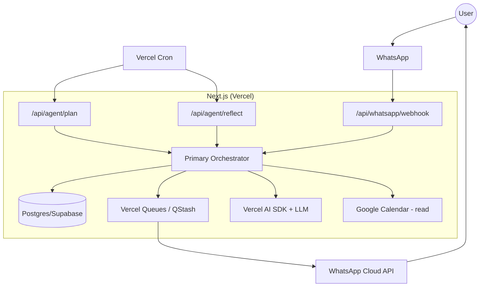
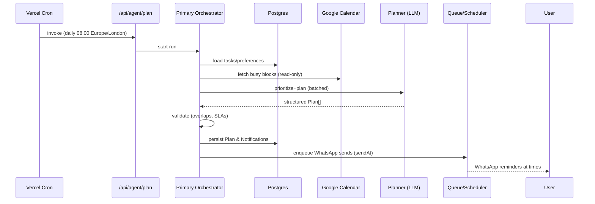
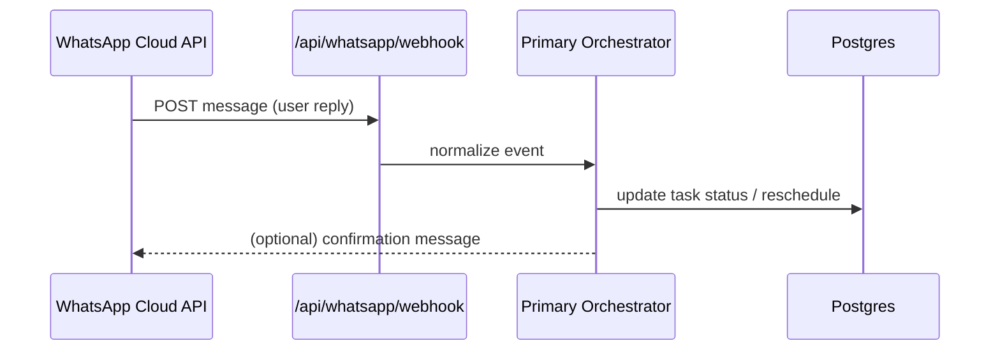
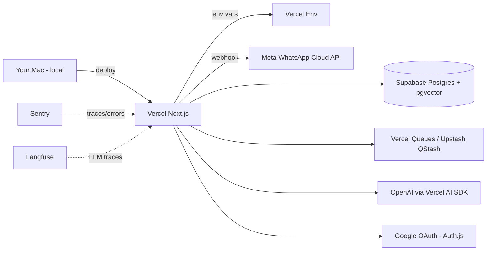
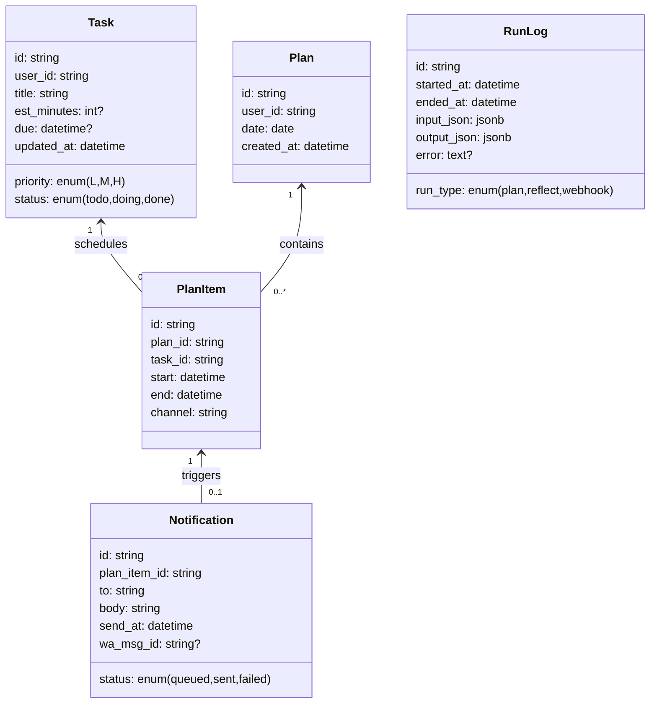

# Never Forget readme

### Core Components
- **Frontend**: Next.js 15 with React 19, Tailwind CSS
- **Database**: PostgreSQL via Prisma ORM
- **Authentication**: NextAuth.js with Prisma adapter and email provider (Mailgun)
- **Payments**: Stripe integration with subscription management
- **Messaging**: WhatsApp Cloud API for reminder delivery
- **AI**: Vercel AI SDK with OpenAI for reminder processing

## Prisma

### Viewing Prisma tables in dev

`npx prisma studio`

### Prisma migrations

After making changes to the prisma schema, they can be applied into the local db with the following commands:

#### Running a schema migration: dev

`npx prisma migrate dev —name <meaningful-name>`

`npx prisma generate`

#### Running a schema migration: prod

Build commands are configured to run a new schema migration with each new build.

# mermaid

## flow graph

## sequence flow

## whatsapp flow

## deployment topology

## model

